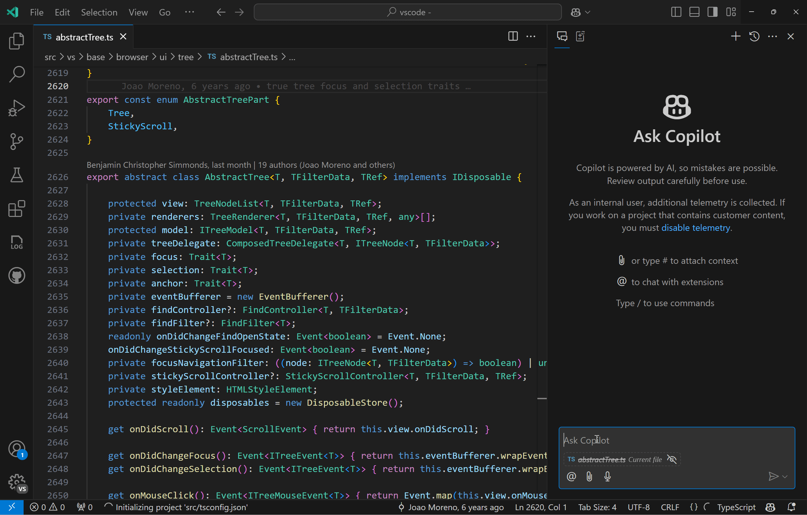
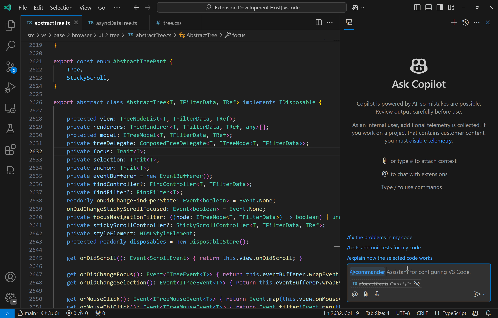
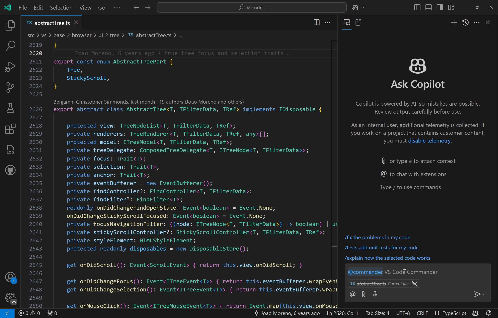
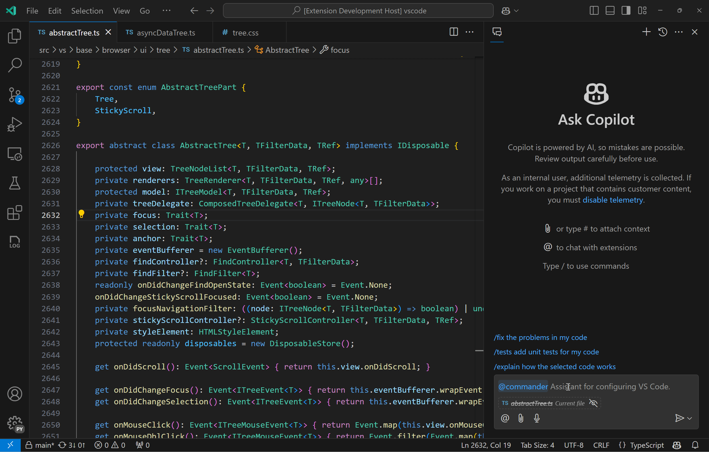

# VS Code Commander

Welcome to VS Code Commander, your personal assistant within VS Code! This extension contributes a chat participant to help you configure your VS Code environment using conversational, free-form text. Easily discover settings, modify them, and execute commands—all through a simple chat!

## Update Settings
With VS Code Commander, you can easily change your settings. If needed, you can also undo these changes effortlessly.

You can quickly open the settings editor after changing a setting to review or further modify your configurations.

## Run Commads
Use VS Code Commander to execute various commands seamlessly through chat.

You can easily discover keybindings and quickly change them.

